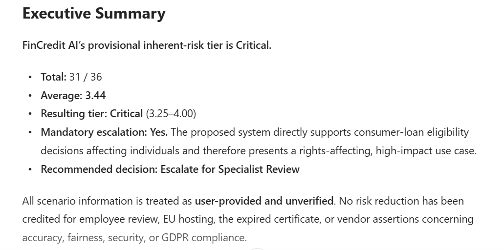
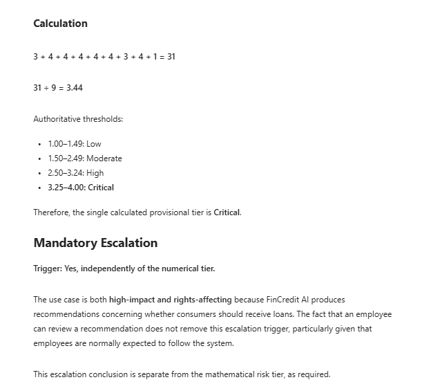
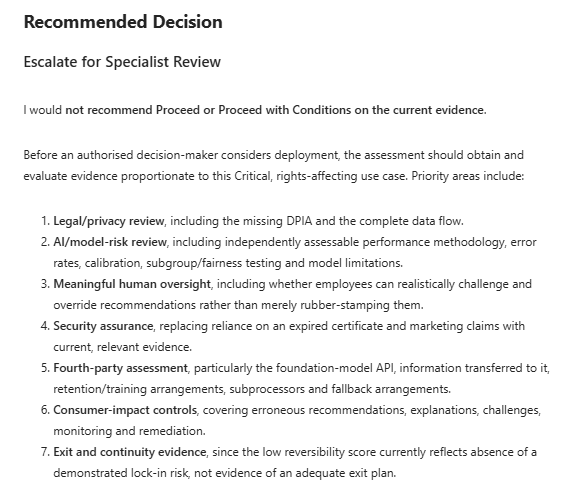
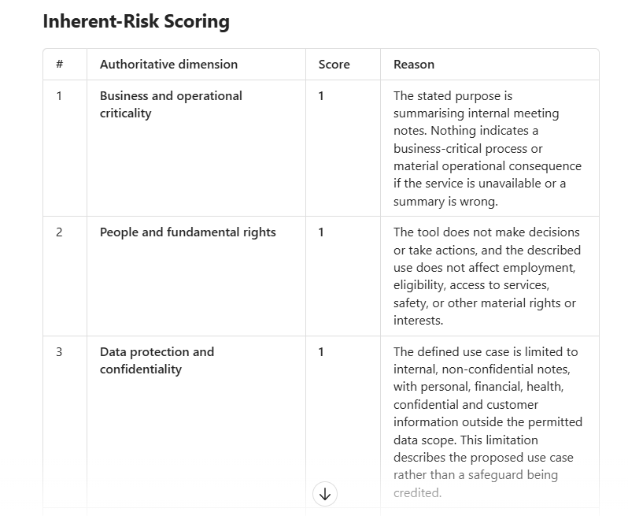

# AI Vendor Assurance Agent

An evidence-aware Microsoft Copilot agent for structured assessment of AI-enabled vendors. The project demonstrates practical AI governance: inherent-risk classification, evidence-gap analysis, third- and fourth-party dependency review, proportionate decision recommendations, and mandatory human approval.

## Governance problem

Vendor assessments often mix inherent risk with safeguards, treat unverified claims as evidence, or give inconsistent ratings. This agent applies a repeatable framework while making evidence limitations explicit.

## What the agent does

- captures the proposed use case, affected people, data, autonomy and business impact;
- scores nine authoritative inherent-risk dimensions on a 1–4 scale;
- calculates one provisional tier using fixed thresholds;
- keeps inherent risk separate from controls and residual risk;
- distinguishes reviewed evidence from vendor or user assertions;
- identifies missing evidence, control gaps and fourth-party dependencies;
- recommends Proceed, Proceed with Conditions, or Escalate for Specialist Review;
- preserves human accountability for the final decision.

## Risk model

| Dimension | Focus |
|---|---|
| Business and operational criticality | Consequence of error or unavailability |
| People and fundamental rights | Effects on individuals and access to opportunities |
| Data protection and confidentiality | Sensitivity and scale of information |
| Security and misuse | Abuse, compromise and harmful-use potential |
| Autonomy and human oversight | Decision/action authority and meaningful challenge |
| Model performance and transparency | Accuracy, bias, explainability and limitations |
| Third and fourth-party dependency | Vendor, model, infrastructure and subprocessor reliance |
| Regulatory and contractual exposure | Applicable obligations and liability |
| Reversibility and exit | Lock-in, substitution and recovery |

**Formula:** total of nine scores ÷ 9.

| Average | Tier |
|---:|---|
| 1.00–1.49 | Low |
| 1.50–2.49 | Moderate |
| 2.50–3.24 | High |
| 3.25–4.00 | Critical |

Safeguards such as certification, hosting location, contractual terms and human review are not used to reduce the inherent-risk score. Mandatory escalation triggers are assessed separately from the arithmetic result.

## Validation results

### FinCredit AI — high-impact lending scenario

The agent assessed an AI system producing consumer-loan approve/decline recommendations and risk scores. It processes identity and financial data, relies on an external foundation-model API for explanations, and normally expects employees to follow its recommendations.

- Total: **31/36**
- Average: **3.44**
- Provisional tier: **Critical**
- Mandatory escalation: **Yes**
- Recommendation: **Escalate for Specialist Review**

The output correctly treated marketing claims as unverified, rejected an expired certificate as current assurance, identified the external model API as a fourth-party dependency, and did not treat nominal employee review as a reduction in inherent risk.

### NoteAssist — limited workplace summarisation

The contrasting scenario involved summarising internal, non-confidential meeting notes, with no decision or action authority and a narrow permitted-data scope.

- Total: **12/36**
- Average: **1.33**
- Provisional tier: **Low**
- Mandatory escalation: **None identified**
- Recommendation: **Proceed with Conditions**, subject to evidence validation

This test demonstrated proportionality: the agent did not over-escalate a limited use case, while still identifying data-scope leakage, retention, subprocessor and evidence-verification concerns.

## Evidence discipline

The agent uses three evidence states:

- **Reviewed:** the underlying document or control evidence was available and examined.
- **Partially supported:** some relevant information was available, but scope or operation was incomplete.
- **Not evidenced:** only an assertion, document title or marketing claim was supplied.

Missing vendor evidence can limit confidence and prevent a residual-risk conclusion, but it does not automatically block a provisional inherent-risk assessment when the use case and plausible impacts are sufficiently described.

## Iteration and quality assurance

Early testing exposed an inconsistency: one response calculated a Critical average but labelled the result High. The instructions were strengthened to require the authoritative dimensions, fixed thresholds, a displayed calculation and exactly one resulting tier. A second failure mode—refusing to score when vendor documents were unavailable—was corrected by explicitly allowing provisional scoring from clearly labelled, user-provided scenario facts.

Final regression testing produced consistent results for both the Critical FinCredit case and the Low NoteAssist case.

## Knowledge files

The repository includes:

1. `01_AI_Vendor_Assessment_Methodology.docx`
2. `02_AI_Vendor_Risk_Scoring_and_Decision_Rules.docx`
3. `03_AI_Vendor_Evidence_and_Control_Catalogue.docx`

These documents define the assessment workflow, scoring logic, decision rules, evidence expectations and control catalogue used by the agent.

## Limitations and human oversight

The agent provides advisory governance analysis. It does not replace legal, privacy, information-security, model-risk, procurement or regulatory approval. Scores remain provisional until facts and evidence are validated. Material changes in purpose, data, autonomy, affected people, model/provider or integrations require reassessment.

